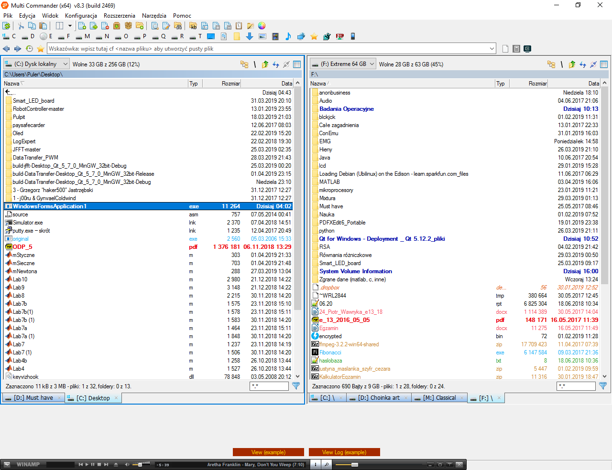
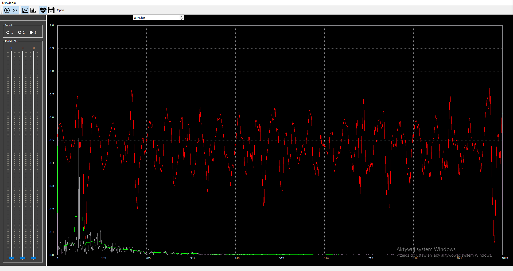

# PWSZ-GraphCreator
### Schemat pliku wejściowego:
Pierwsza lina zawiera liczbę <b>wierzchołków</b> i <b>krawędzi</b> 
kolejnie linie zawierają informacje o kawędziach w schemacie 3 wartości które oznaczają: 
wierzchołek <b>początkowy</b>, <b>końcowy</b> oraz <b>waga</b> tego połączenia krawędzi                                                                             
 </img>

## Istotne pliki
<i> Graph.cs</i> - klasa szukająca najkrótszego obwodu metodą Bellmana-Forda  
W pliku Form1.cs metoda <i> private void button1_Click(object sender, EventArgs e)</i> - odpowiada za wczytywanie danych z pliku  
Pozostałe pliki są nieistotne

# ToDo Sobota
_wybrać nazwę_
 </img>

 </img>

 </img>

 </img>
