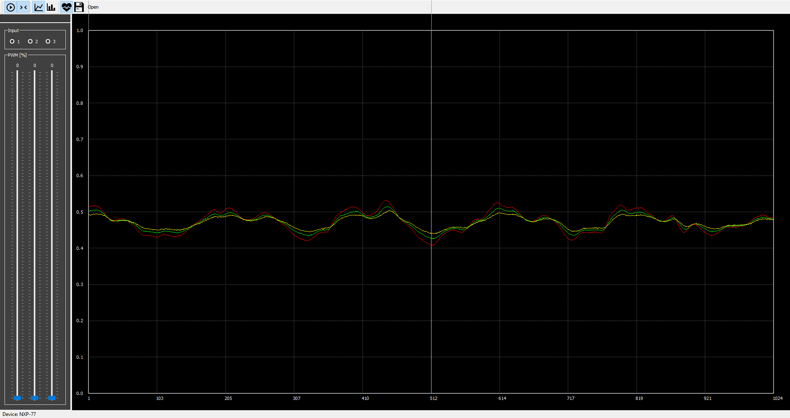
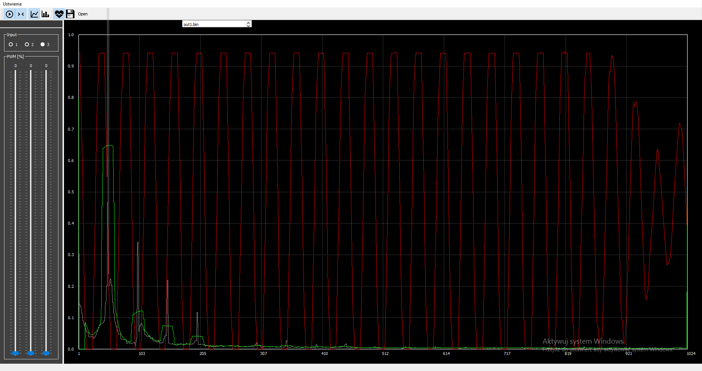

# <a href="https://informacja.github.io/PWSZ-GraphCreator/">PWSZ-GraphCreator</a>

 </img>
<a href="
https://pythex.org/?regex=(%5Cd%2B%5Cs%2B%5Cd%2B%5Cs%2B(%3F%3A(%3F%3A%5Cd%2B%5C.%5Cd%2B)%7C%5Cd%2B))(%3F%3A%5C.%5B%5CS%5Cd%5D%2B)*&test_string=015%20%2031%20333.33.4error4%0A4%2046%204%205%204%0A4%20%20034%2035%0A4444%20%20%0A5%204%205.5%201%20(%3F<!%5C.)%5Cd%2B%20(%3F<!%20znak)%20oznacza%2C%20wcześniej%20"<"%20nie%20jest%20"!"%20znak&ignorecase=0&multiline=0&dotall=0&verbose=1 "> reg</a>
### Schemat pliku wejściowego:
Plik wejściowy zawiera informacje o połączeniach program sam ustala liczbę wierzchołków i krawędzi. 
Każdy wiersz zawierają informacje o krawędzi: 
wierzchołek <b>początkowy</b>, <b>końcowy</b> oraz <b>wagę</b> krawędzi                                                                             
 </img>
 </img> 
Jako tekst widzimy wczytane plik, po pustej lini jest odległośc do każdego kolejnego wierzchołka. 
 </img>
 
https://csacademy.com/app/graph_editor/

## Istotne pliki
<i> Graph.cs</i> - klasa szukająca najkrótszego obwodu metodą Bellmana-Forda  
W pliku Form1.cs metoda <i> private void button1_Click(object sender, EventArgs e)</i> - odpowiada za wczytywanie danych z pliku  
Pozostałe pliki są nieistotne

# Done
_wybrać nazwę_
 </img>

 </img>

 </img>
=======
PWSZ - Graph Creator

#How to use
-------
- Use left mause button to create new node
- Click node and move mause pointer to next node to link them
- Use key "R" to change direction of link
- Use key "Delete" to remove selected node or link
